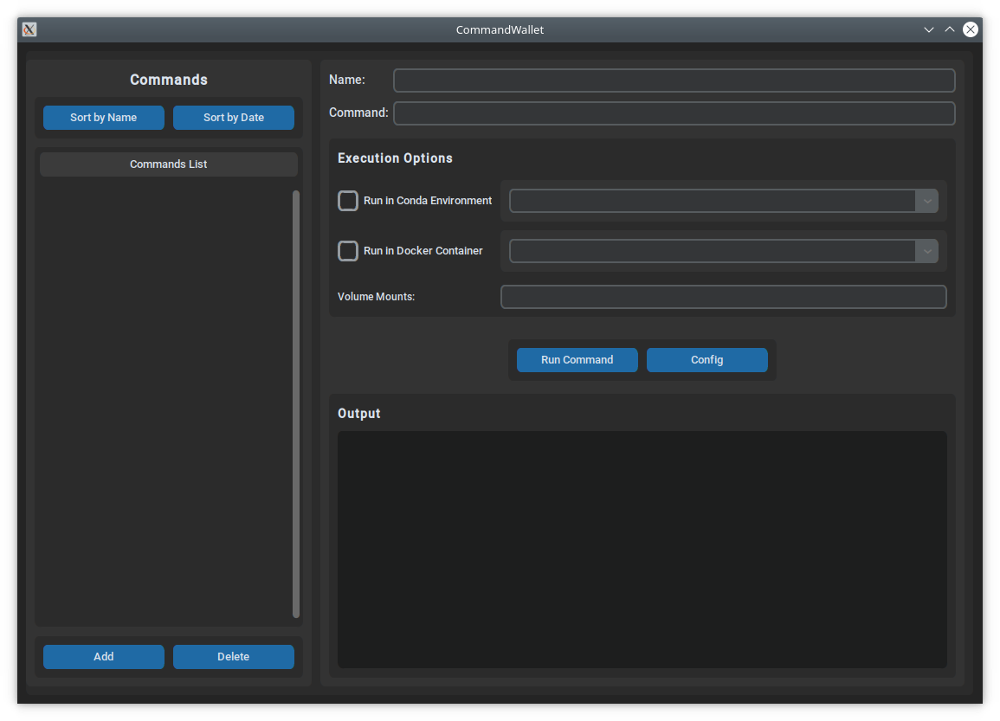

# CommandWallet

🚀 A modern and user-friendly desktop application for managing and executing recurrent CLI commands with support for Conda environments and Docker containers.



## ✨ Features

- ✨ **Modern CustomTkinter UI**: Beautiful, modern interface with dark theme and enhanced visual appeal
- 🛠️ **Command Management**: Create, edit, and delete commands with custom names
- 🐍 **Conda Environment Support**: Run commands in specific Conda environments with searchable dropdown
- 🐳 **Docker Container Support**: Execute commands inside Docker containers with:
  - 🔍 Automatic path inference from command text
  - ⚙️ Configurable fixed mounts through configuration dialog
  - 📂 Unified volume mounts field with auto-inference and manual editing
- 🔎 **Searchable Dropdowns**: Type to filter Conda environments and Docker images
- ⏱️ **Real-time Output**: View command execution results in real-time with timestamps
- 🖋️ **Modern Typography**: Clean, readable fonts with proper sizing for optimal user experience
- 📋 **Command Sorting**: Sort commands by name or last execution date with proper handling of never-executed commands
- 📅 **Execution Tracking**: Last execution date is saved and displayed via tooltips in command list
- 💾 **Auto-save**: All changes in the GUI are automatically saved to configuration files
- 💡 **Persistent Storage**: Commands and configuration automatically saved in `~/.command-wallet/`
- ⚡ **Threading**: Non-blocking command execution to keep the GUI responsive
- 🖥️ **Full Screen**: Application starts in maximized window for better workspace utilization

## 🖼️ Screenshots

The application features:
- **Left Panel**: Command selection with sorting options (by name/date) and management buttons
- **Right Panel**: Command editor with modern CustomTkinter widgets and clean layout
- **Execution Options**: Checkboxes for Conda/Docker with searchable dropdown menus
- **Volume Mounts**: Unified field for Docker volume mounts with auto-inference
- **Output Area**: Real-time, scrollable command output with starting timestamp and monospaced font to see command outputs

## 📦 Requirements

- Python 3.6 or higher
- **CustomTkinter**: Modern tkinter replacement for enhanced UI (automatically installed via conda environment)
- Standard library modules: subprocess, threading, json, os

### 🧩 Optional Dependencies

- **conda**: For Conda environment support
- **docker**: For Docker container support

## ⚙️ Installation

Using Conda (Recommended):
1. Clone or download the repository
2. Create the conda environment:
   ```bash
   conda env create -f environment.yml
   ```
3. Activate the environment:
   ```bash
   conda activate commandwallet
   ```
4. Launch the application:
   ```bash
   python command_wallet.py
   ```

Manual Installation:
1. Clone or download the repository
2. Run the setup checker:
   ```bash
   python3 setup.py
   ```
3. Launch the application:
   ```bash
   python3 command_wallet.py
   ```
   or
   ```bash
   ./run.sh
   ```

## ▶️ Usage

### 📝 Basic Usage

1. **Launch the application**
2. **Add a new command** by clicking the "Add" button
3. **Enter command details**:
   - Name: Give your command a descriptive name
   - Command: Enter the CLI command to execute
4. **Click "Run Command"** to execute

### 🐍 Using Conda Environments

1. Check the "Run in Conda Environment" checkbox
2. Select the desired environment from the dropdown
3. The command will be executed using `conda run -n <environment> <command>`

### 🐳 Using Docker Containers

1. Check the "Run in Docker Container" checkbox
2. Select the desired Docker image from the dropdown (or type to search)
3. **Volume Mounts**: The application automatically infers and populates volume mounts based on paths in your command
4. **Manual Editing**: Edit the Volume Mounts field to customize mounts as needed
5. **Fixed Mounts**: Use the Config button to set up mounts that are always applied
6. The command will be executed with all mounts combined

### 📂 Path Inference

The application automatically detects file paths in your commands and suggests appropriate Docker mounts:
- Absolute paths (e.g., `/mnt/data/file.txt`) → `-v /mnt/data:/mnt/data`
- Home directory paths (e.g., `~/Documents/file.txt`) → `-v /home/user/Documents:/home/user/Documents`
- Multiple paths are consolidated to common parent directories

### ⚙️ Configuration

Click the "Config" button to access:
- **Fixed Docker Mounts**: Set up mounts that are always applied to Docker commands
- These mounts are persistent and applied to all Docker executions

### 🗂️ Managing Commands

- **Select**: Click on a command in the left panel to load it
- **Sort**: Use "Sort by Name" or "Sort by Date" buttons to organize your commands
- **Tooltips**: Hover over command names to see last execution date
- **Edit**: Modify the name, command, or execution options
- **Delete**: Select a command and click "Delete"
- **Execution History**: Commands show when they were last executed via tooltips
- **Auto-save**: Changes are automatically saved

## 💾 Data Storage

Commands are stored in `~/.command-wallet/commands.json` and configuration in `~/.command-wallet/config.json` in the user's home directory. These files are automatically created and updated as you add or modify commands and settings. All changes in the GUI are immediately saved to these files.

## 💡 Example Commands

Here are some example commands you might store:

- **Python Script**: `python my_script.py`
- **System Info**: `uname -a`
- **Docker List**: `docker ps -a`
- **Conda List**: `conda list`
- **Git Status**: `git status`

## 🛠️ Troubleshooting

### 🖼️ tkinter Not Available

If you get an error about tkinter not being available:

- **Ubuntu/Debian**: `sudo apt-get install python3-tk`
- **CentOS/RHEL**: `sudo yum install tkinter`
- **macOS**: tkinter should be included with Python

### 🐍 Conda Commands Not Working

Ensure conda is properly installed and available in your PATH:
```bash
conda --version
```

### 🐳 Docker Commands Not Working

Ensure docker is properly installed and you have the necessary permissions:
```bash
docker --version
docker ps
```

## 👩‍💻 Development

### 🗂️ Project Structure

```
command-wallet/
├── command_wallet.py          # Main application
├── setup.py                   # Setup and dependency checker
├── run.sh                     # Launch script
├── README.md                  # This file
├── environment.yml            # Conda environment configuration
├── .github/
│   └── copilot-instructions.md # Copilot instructions
└── .vscode/
    └── tasks.json             # VS Code tasks

~/.command-wallet/             # User data directory
├── config.json                # Application configuration (created at runtime)
└── commands.json              # Command storage (created at runtime)
```

### 🧩 Key Components

- **CommandWallet class**: Main application controller
- **GUI Layout**: Left panel for command selection, right panel for editing
- **Command Execution**: Threading-based execution with real-time output
- **Data Persistence**: JSON-based storage for commands

## 📜 License

This project is open source and available under the MIT License.

## 🚧 Future Enhancements

- Import/export command sets
- Command categories and tags
- Keyboard shortcuts
- Command history
- Environment variable support
- Command templates
- Better error handling and logging
